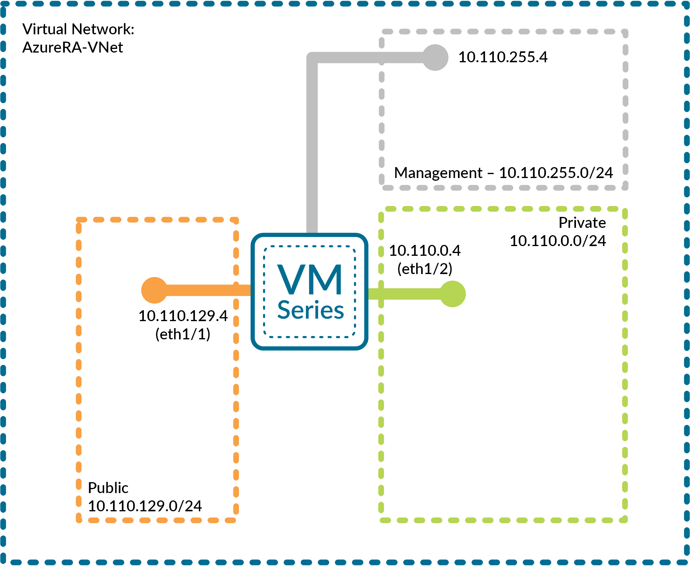

# Deploy a VM-Series firewall into an existing Azure Resource Group

This template deploys a (3) interface Palo Alto Networks VM-Series firewall as shown below:

  

This template supports two deployment options:
- manual deployment of VM-Series.
- automated bootstrapping of VM-Series when used with Panorama and you have already created the bootstrap package and deployed to a filesystem in an Azure Storage Account.

This template was created to support the deployment of a 3 interface Palo Alto Networks firewall into an existing Microsoft Azure environment that has the following items already deployed:

                    - VNET (assumes "AzureRA-VNet" is already created with following subnets):
                      - Management (10.110.255.0/24)
                      - Public (10.110.129.0/24)
                      - Private (10.110.0.0/24)
                    - Resource Group (for the firewall) with the following resources:
                      - Availability Set for the firewall
                      - Storage Account for the firewall VHD
                      - Public IP address (Standard SKU) for the firewall management interface
                    
            
FEATURES:
- The firewall deploys with (3) interfaces
  - (1) management interface 
  - (2) dataplane interfaces
  
- You may choose the version of software the firewall is running (9.1.3, 10.0.0 or latest).
- You may choose the deployment SKU for the firewall: (byol, bundle1 or bundle2).
- Static IP address assignment is used for all the firewall interfaces.

The following Storage Account types are supported:

                    -Standard_LRS (used in deployment guide)
                    -Standard_GRS
                    -Standard_RAGRS
                    -Premium_LRS
                    
The following VMs are supported:

                    -Standard_D3
                    -Standard_D4
                    -Standard_D3_v2 (used in deployment guide)
                    -Standard_D4_v2
                    -Standard_A4
                    -Standard_DS3_v2
                    -Standard_DS4_v2
        
NOTE: Make sure the VMs are supported in the specific Storage Account Type and Azure Region.

After deployment, this firewall can be integrated into Azure load balancer backend pools or Azure application gateway backend pools using the Azure Resource Manager Portal.

# Support

This template/solution is released under an as-is, best effort, support policy. These scripts should be seen as community supported and Palo Alto Networks will contribute our expertise as and when possible. We do not provide technical support or help in using or troubleshooting the components of the project through our normal support options such as Palo Alto Networks support teams, or ASC (Authorized Support Centers) partners and backline support options. The underlying product used (the VM-Series firewall) by the scripts or templates are still supported, but the support is only for the product functionality and not for help in deploying or using the template or script itself. Unless explicitly tagged, all projects or work posted in our GitHub repository (at https://github.com/PaloAltoNetworks) or sites other than our official Downloads page on https://support.paloaltonetworks.com are provided under the best effort policy.

For assistance from the community, please post your questions and comments either to the GitHub page where the solution is posted or on our Live Community site dedicated to public cloud discussions at https://live.paloaltonetworks.com/t5/AWS-Azure-Discussions/bd-p/AWS_Azure_Discussions
